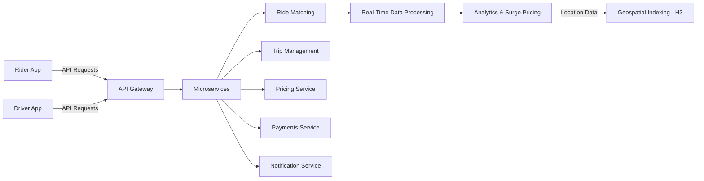
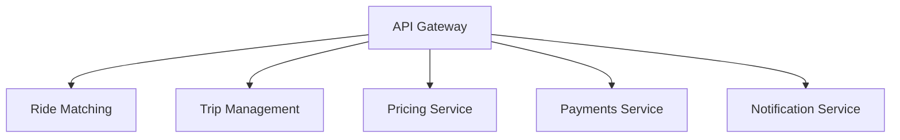
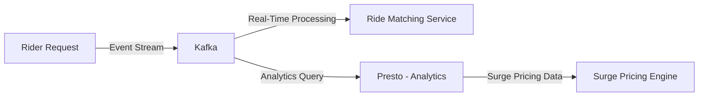
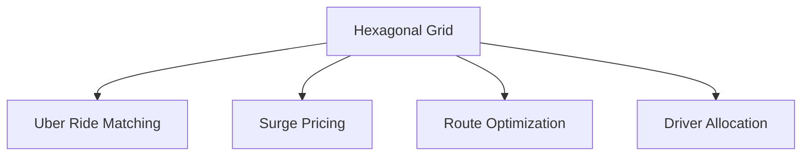
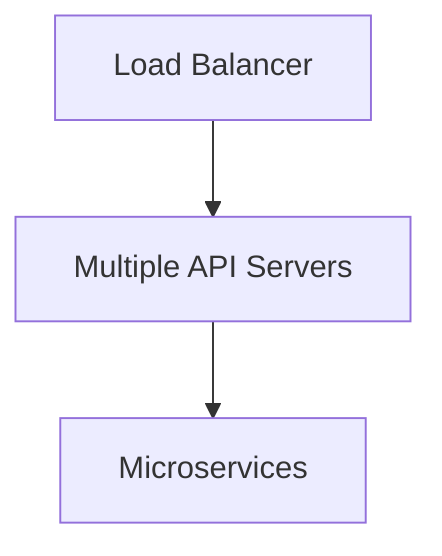

# **Uber’s System Design: Architecture, Components, and Technologies**

Uber has transformed the transportation industry through a highly **scalable and reliable system architecture**. Given its **global reach**, Uber must handle **millions of ride requests per second**, optimize **driver-rider matching in real-time**, and ensure **seamless financial transactions**.

This article breaks down Uber’s system design, covering its **architecture, key components, real-time data processing, and geospatial indexing using H3**, with **Mermaid diagrams** to enhance clarity.

---

## **1. System Architecture Overview**

Uber initially started with a **monolithic architecture**, but as demand grew, it transitioned into a **microservices-based architecture** to handle the **massive scale, real-time processing, and fault tolerance** required for smooth operations.

### **Uber's High-Level Architecture**
At a high level, Uber’s system consists of:
- **Mobile & Web Clients** (Riders & Drivers)
- **Backend Microservices** (Ride Matching, Pricing, Payments, Notifications, etc.)
- **Data Processing & Analytics**
- **Geospatial Services (H3)**
- **Infrastructure & Deployment (AWS, Kubernetes, etc.)**

### **Diagram: Uber's High-Level Architecture**

---

## **2. Uber’s Microservices Architecture**
To ensure **scalability, reliability, and modularity**, Uber transitioned from a **monolithic** to a **microservices architecture**.

Each microservice is responsible for a specific task:
- **Ride Matching Service**: Connects riders with the closest available drivers.
- **Trip Management Service**: Tracks trip status, driver movements, and ride duration.
- **Pricing Service**: Determines fares based on **distance, demand, and traffic conditions**.
- **Payment Service**: Processes payments, promotions, and refunds.
- **Notification Service**: Sends real-time updates to riders and drivers.

### **Diagram: Microservices Breakdown**

### **Benefits of Microservices**
✅ **Scalability** – Services scale independently based on demand.  
✅ **Fault Tolerance** – Failure in one service doesn’t impact the entire system.  
✅ **Faster Development** – Teams can work on different services separately.  

---

## **3. Real-Time Data Processing in Uber**
Uber handles **real-time data streaming** to process **ride requests, driver locations, and pricing changes dynamically**.

Key Technologies:
- **Apache Kafka** – Manages real-time event streaming for trip data.
- **Apache Flink/Spark** – Processes large-scale data for analytics.
- **Presto** – Runs SQL queries on big data.

### **Diagram: Real-Time Data Flow**

---

## **4. Uber’s Geospatial Indexing with H3**
Uber needs a **highly efficient spatial system** to quickly match riders with nearby drivers. This is where **H3** (Uber’s open-source geospatial system) comes in.

### **Why Hexagonal Grids (H3)?**
- **Uniform Cell Size**: Unlike squares, hexagons have **equal distances between centers**, making spatial calculations more accurate.
- **Hierarchical Indexing**: Supports **multiple levels of resolution**, from **city-wide zones to precise street-level grids**.
- **Efficient Neighbor Searches**: Since hexagons have **six adjacent neighbors**, finding nearby drivers is faster.

### **Diagram: H3 Hexagonal Grid**

**Example of Uber’s H3 Usage**
- When a ride request is made, Uber converts the **latitude & longitude into an H3 hex index**.
- Uber **fetches all drivers** in the **same hexagon and adjacent hexagons** to quickly match the rider.

---

## **5. Scaling & Reliability in Uber’s System**
Uber’s system must **scale dynamically** to handle high demand and **ensure fault tolerance**.

Key Technologies:
- **Load Balancers**: Distribute requests across multiple instances.
- **Auto-Scaling (Kubernetes)**: Adds or removes compute resources based on demand.
- **Distributed Databases (Cassandra, DynamoDB)**: Ensures data availability and fast reads/writes.

### **Diagram: Scaling Architecture**

---

## **6. Security & Data Privacy**
Since Uber processes **millions of transactions daily**, it prioritizes **security** and **compliance**.

### **Security Measures**
- **Data Encryption** – Ensures secure transmission of user data.
- **Access Control** – Limits system access to authorized personnel.
- **Fraud Detection Systems** – Identifies and prevents fraudulent transactions.

---

## **7. Key Takeaways**
🔹 Uber **moved from a monolithic to a microservices-based architecture** to handle scalability.  
🔹 **Real-time data processing (Kafka, Flink, Presto)** allows for instant ride matching and pricing updates.  
🔹 **H3 geospatial indexing** helps find the nearest drivers **efficiently using a hexagonal grid system**.  
🔹 **Load balancing, auto-scaling, and fault tolerance** ensure system reliability.  
🔹 Uber follows **strict security protocols** to protect user data and prevent fraud.  

---

## **Conclusion**
Uber’s system design is a **prime example of a modern, real-time, distributed system**. By leveraging **microservices, geospatial indexing, real-time data processing, and cloud scaling technologies**, Uber ensures a **seamless experience** for riders and drivers worldwide.

🚀 **Want to learn more? Check out Uber’s engineering blog:**  
🔗 [Uber Engineering Blog](https://eng.uber.com/)  
🔗 [H3 Documentation](https://h3geo.org/)  

---

Would you like any **additional details or explanations** on specific areas? 🚖
